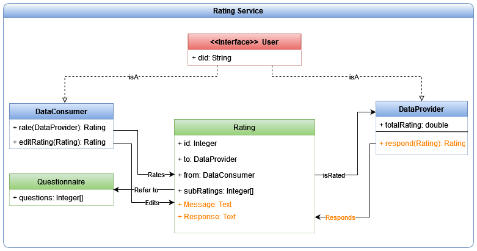

# Rating Component

A modular component allowing users to create, manage and aggregate rating objects on Various i3Market transactions.



The main flow revolves around 4 main operations.

### Create A new Rating
The data consumer creates a new rating object, on a specific agreement and data provider, containing the actual subratings, as well as a free text comment.

### Respond to a Rating
The data provider can post a free text response, on the rating object created by the consumer, addressing various points in the rating or the comment.

### Update a Rating
The data consumer can either change the actual subratings, or their comment on a previously created rating. This deletes any previous responses from the provider automatically (as they are no longer applicable).

### Aggregate Ratings
Everyone can retrieve the total rating of a provider (not applicable to consumers) based on every rating object posted for that particular provider.

## Installation

### Requirements

NodeJS\
npm\
Docker\
A working deployment of Smart Contract Manager (Optionally)\
A working deployment of Notification Manager (Optionally)\
A local instance of MongoDB (included in docker)

### Run with Docker
The project currently contains two containers, the main backend service and an internal mongoDB database. Both can be initialized via docker compose.

1) Clone the project
2) Configure the .env file
3) Run both containers with docker compose

``` bash
docker compose up
```
4) The rating backend is running on http://localhost:3001
5) The OAS documentation can be accessed [here](http://localhost:3001/api-docs/)

### Confiruring the .env file
MONGO_URL = The connection string to the local mongodb instance
MONGO_PORT = The port mongoDB runs on, MUST match the one in MONGO_URL
MONGO_USER = Your mongoDB user name, MUST match the one in MONGO_URL
MONGO_PASSWORD = Your mongoDB user password, MUST match the one in MONGO_URL
OIDC_URL = The url of the OIDC used for user authentication
NOTIFICATION_URL = The url of the notification manager (Optional, not able to post notifications)
AGREEMENT_URL = The url of the SC Manager (Optional, not able to retrieve agreements)
JWKS_PATH = The JWKS path in the OIDC, usually "/oidc/jwks"
BACKEND_PORT = The port this serviice runs on the host machine
DEBUG = TRUE ONLY include this to test rating/delete and questions/update which are disabled by default

## Credits
George Benos (gbenos@telesto.gr)\
Edgar Fries (edgar.fries@siemens.com)

## Contributing
Pull requests are welcome.

Please make sure to update tests as appropriate.

## License
[EUPL-1.2](https://choosealicense.com/licenses/eupl-1.2/)
